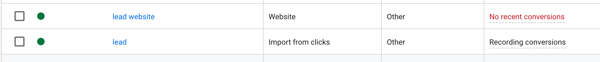
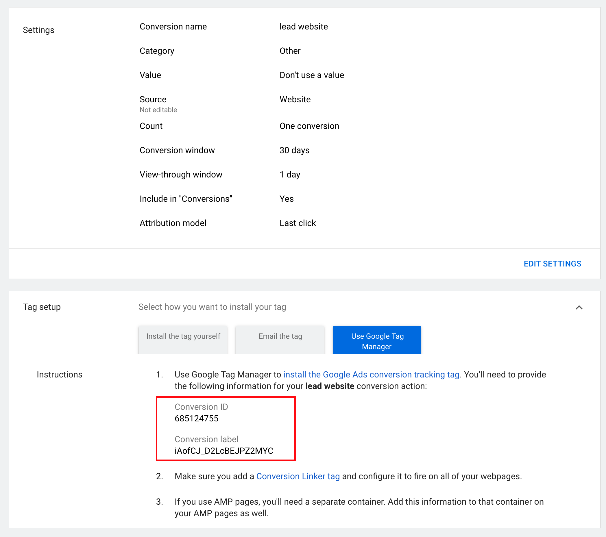

## GoogleAds Pixel

### setting up the pixel

We will set up two conversions : ***lead website*** and ***lead***

1. **lead website** : that we will fire automatically from the lander.

keep note of the ***conversion ID*** ( associated to your googleads account ) and ***conversion Label*** ( specific to that conversion event )

2. **lead** : we will import them manually in case of FTD ( first time deposit ). We don't need any conversion ID here, but the name ***lead*** matter!

### Set up pixel on blackflow

On your ad account on blackflow, enter this as pixel : 

`{conversion ID}-{Conversion Label}`

in this example, it looks like this: 

`685124755-iAofCJ_D2LcBEJPZ2MYC`

