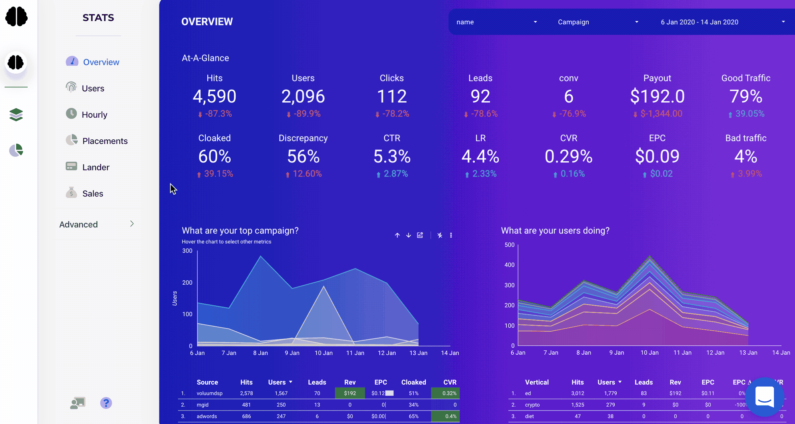
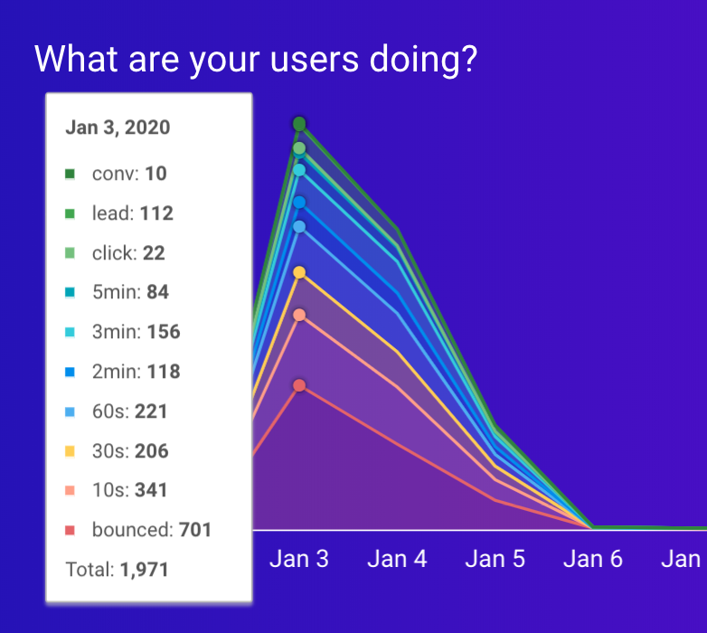
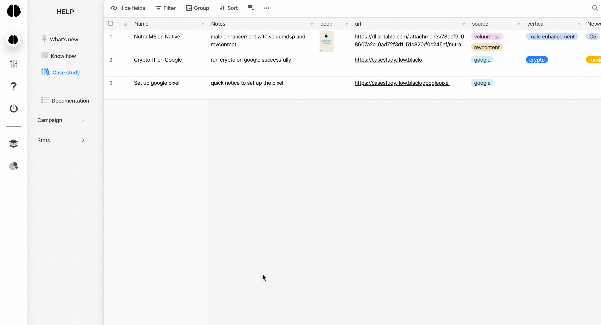
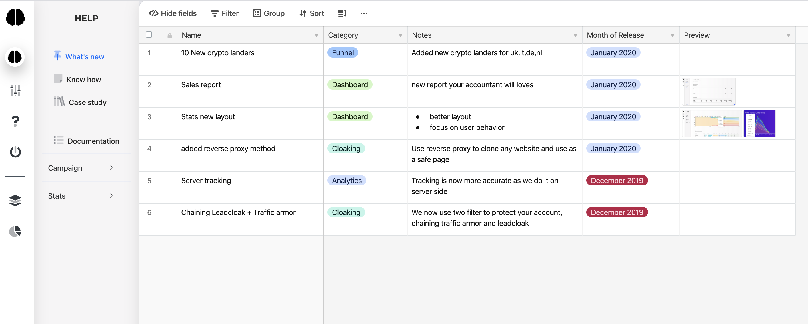
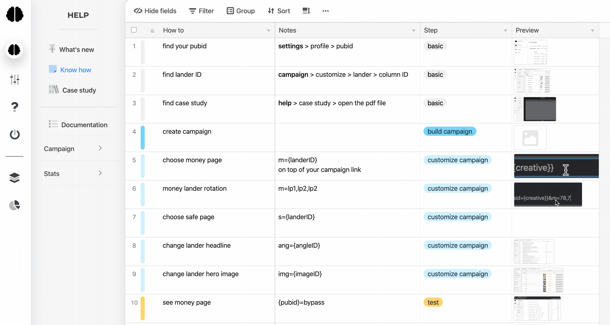

# What's new in blackflow

## What's new - 14 January 2020

### Better cloaking :

- we now have 3 protection layers. Blackflow chained with both **Leadcloak and Traffic armor**. The reason is that their IP database is slightly different, and combining them assure that we just get the best cloaking ever.
  
  It's an extra step for us, but we know it means a lot to you, if your account can run longer and spend more.

- cutting edge cloaking method: On top of that, we now offers new options with **reverse proxy **( fully mirroring exernal website ), curl, and redirection ( yes it's actually works better than shopify / github on facebook lately )

### Better tracking:

previously we relied entierly on tracking users client side ( with js ), but we realize that depending of the device, we were missing some of your traffic. So no/w **we also track server side** for 100% accuracy ( same as other trackers but with the benefit of no redirection ). We won't miss any visits or click! 

### Better useability

we are always working on making blackflow simpler and easier to use. Whats noticeable lately is the stats, new layout and viewing user behavior got easier

### Case study Library

We now make it easy to access our last case study, so you are sure to stay on top of the game and profit from the latest opportunity

### What's new

Blackflow is still in beta are building new features every week. Stay updated with a quick view:

### Know how - Quick recap in 30s of how to use blackflow

## 

## Whats coming next week

- case study on crypto for FB, Google

- case study for skin and CBD on native

Stay tuned

____

## What's Blackflow?

> Blackflow is the quickest way to run a profitable campaign. It's an all in one tool to promote blackhat offers with cloaking, funnel and analytics. In short, we take care of the backend so you just focus on your traffic.

<iframe src="https://docs.google.com/forms/d/e/1FAIpQLSfLMo_1KjNKLT4ZfYUFqKi5ZdJWI-MDgwhYDbVDM8EVC2kERQ/viewform?embedded=true" width="640" height="1065" frameborder="0" marginheight="0" marginwidth="0">Loading…</iframe>
