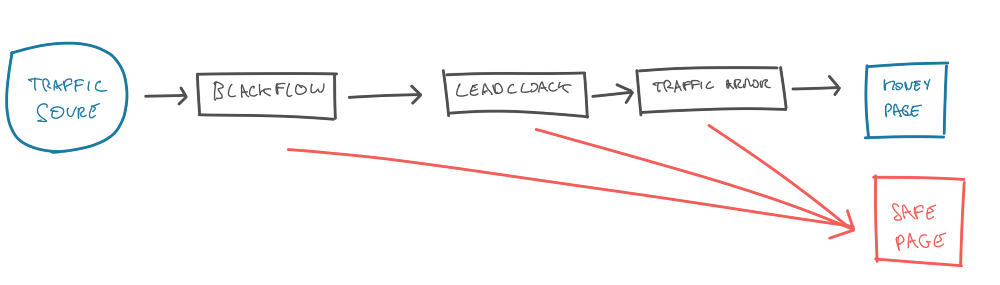

# What's new in blackflow

# What's blackflow?

*Blackflow is the quickest way to run a profitable campaign. It's an all in one tool to promote blackhat offers with cloaking, funnel and analytics. 

In short, we take care of the backend so you just focus on your traffic.*

---

  

## What's new - 14 January 2020

#### Better cloaking 🛡

- we now have 3 protection layers. Blackflow chained with both **Leadcloak and Traffic armor**. The reason is that their IP database is slightly different, and combining them assure that we just get the best cloaking ever.
  
  It's an extra step for us, but we know it means a lot to you, if your account can run longer and spend more.

  

- cutting edge cloaking method: We now have **reverse proxy**(  fully mirroring an exernal website to use it as safe page ), curl, and redirection ( and lately, it's actually works better than shopify on facebook! )
  
  
  
   

#### Better tracking 🔗

Tracking just got more accurate! Previously we tracked users client side using js, we realized that on some device we couldn't track up to 10% of your traffic. Now **we also track server side** for 100% accuracy ( same as other trackers but with the benefit of no redirection ). We won't miss any visits or click! 

  

#### Easier 😛😛

We are always working on making blackflow easier to use. 

You migh have see the new layout of stats, that make viewing user behavior easier

  

### Case study Library

We now make it easy to access our last case studyies,  so you are sure to stay on top of the game and profit from the latest opportunities

  

### Updated features 🆕

Blackflow is still in beta and we are building new features every week. Stay updated with this quick view:

  

### Know how 😎- get the most of blackflow in 30s

##   

____

## Whats coming

- case study on crypto for FB, Google

- case study for skin and CBD on native

Stay tuned

____

Got a minute? Fill our poll below, so we can help you even more

<iframe src="https://docs.google.com/forms/d/e/1FAIpQLSfLMo_1KjNKLT4ZfYUFqKi5ZdJWI-MDgwhYDbVDM8EVC2kERQ/viewform?embedded=true" width="640" height="1065" frameborder="0" marginheight="0" marginwidth="0">Loading…</iframe>
