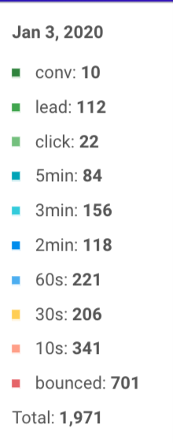

What's new

# What's blackflow?

*Blackflow is the quickest way to get a profitable campaign. It's an all in one tool to promote blackhat offers with cloaking, funnel and analytics - nothing to set up.*

In short, we take care of the backend, **so you just focus on your traffic.**

____

 

## What's new - 21 January 2020

## Smarter funnel

Most affiliates promoting crypto are not putting the effort to match the offer screenshot on the lander. Instead they are using outdated image, even in the wrong country currency...

Other vertical like nutra or sweeptakes have since long time optimized their lander to match the country or ISP.

So blackflow funnel got smarter for crypto too! the step1, step2, step3 images on the lander now dynamically match the offer. 

The benefit is that it's more congruency => more certainty for the user => more FTDs!

**Example for DE**: We show Germany flag, EUR currency, and Deutsche language. ( Again this is obvious but most affiliate are not doing it as it extra work to update it ) 

step1

step2

step3

## What's new - 14 January 2020

Summing things up: cloaking and tracking improvment, better UI and some nice tools to make blackflow easier.

#### 1) Better cloaking 🛡

- we now have 3 protection layers. Blackflow chained with both **Leadcloak and Traffic armor**. The reason is that what they check and their IPs database is slightly different, and combining them assure that we just get the best cloaking ever.
  
  It's an extra step for us, but we know it means a lot to you, if your account can run longer and spend more.
  
  

- cutting edge cloaking method: We now have **reverse proxy**(  fully mirroring an exernal website to use it as safe page ), curl, and redirection ( and lately, it's actually works better than shopify on facebook! )

 

#### 2) More accurate tracking 🔗

Tracking just got more accurate! Previously we tracked users client side using js, we realized that on some device we couldn't track up to 10% of your traffic. Now **we also track server side** for 100% accuracy ( same as other trackers but with the benefit of no redirection ). We won't miss any visits or click! 

  

#### 3) Even Easier 😛😛

We are always working on making blackflow easier to use. 

Check the new stats dashboard to see your users behavior.

  

### 4) Cases studies Library

We now make it easy to access our last case studyies,  so you are sure to stay on top of the game and profit from the latest opportunities

  

### 5) Updated features 🆕

Blackflow is still in beta and we are building new features every week. Stay updated with this quick view:

  

### 6) Know how 😎- get the most of blackflow in 30s

## 

 

## Whats Coming Next

- case study on crypto for FB, Google

- case study for skin and CBD on native
  
   

____

   

Got a minute?

 Fill our poll below, so we can help you even more>

  

<iframe src="https://docs.google.com/forms/d/e/1FAIpQLSfLMo_1KjNKLT4ZfYUFqKi5ZdJWI-MDgwhYDbVDM8EVC2kERQ/viewform?embedded=true" width="640" height="1065" frameborder="0" marginheight="0" marginwidth="0">Loading…</iframe>
